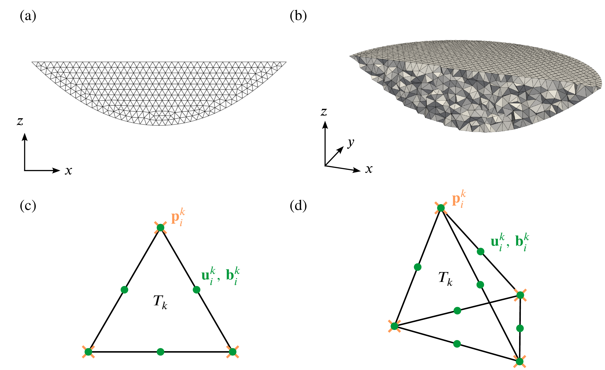
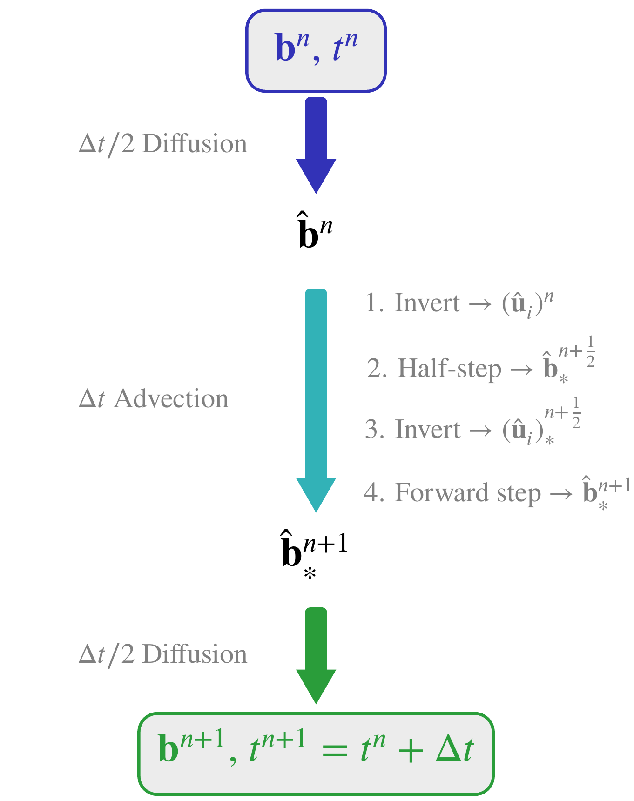

# Numerical Approach

Here we'll describe the numerical scheme used in the $\nu$PGCM to solve the nondimensional PG equations described [previously](nondimensionalization.md).
We discretize the domain using an unstructured mesh of tetrahedra, allowing considerable geometrical flexibility at the cost of requiring a more sophisticated numerical method than standard finite differences on a structured grid.
The numerical solution satisfies the weak Galerkin form of the equations and lives in a specially chosen finite element space to guarantee stability.
To obtain smooth solutions, we must artificially increase the aspect ratio $\alpha$, introducing diffusion in the hydrostatic equation.
The matrix equations for the PG inversion and evolution are solved separately using iterative solvers.
We use Strang splitting to handle advection and diffusion as separate partial steps in the evolution equation.

## Weak formulation

To derive the finite element formulation of the model equations, we first define the function spaces in which we would like our solutions to live.
These spaces need not specify any Neumann conditions as those will be taken care of by boundary integrals in the weak formulation, as we will see below.
The velocity, pressure, and buoyancy spaces are then:
```math
\begin{aligned}
    \mathcal{U} &\equiv \Big\{ \vec{u} \in [H^1(\mathcal{D})]^3 : \vec{u} = 0 \; \text{at} \; z = -H \; \text{and} \; w = 0 \; \text{at} \; z = 0 \Big\},\\
    \mathcal{P} &\equiv \Big\{ p \in L^2(\mathcal{D}) : \int_\mathcal{D} p \, \text{d}\vec{x} = 0 \Big\},\\
   \mathcal{B} &\equiv L^2(\mathcal{D}) \quad \text{or} \quad \mathcal{B} \equiv \Big\{ b \in L^2(\mathcal{D}) : b = b_0 \; \text{at} \; z = 0 \Big\},
\end{aligned}
```
respectively, where the buoyancy space depends on whether a Dirichlet or Neumann condition is chosen at the surface.
Here, $[H^1(\mathcal{D})]^3$ refers to the Sobolev space of all three-component vector functions that satisfy
```math
\lVert \vec{u} \rVert_{H^1}^2 = \int_\mathcal{D} \left( u^2 + v^2 + w^2 + |\nabla u|^2 + |\nabla v|^2 + |\nabla w|^2 \right) \, \text{d}\vec{x}  < \infty,
```
and $L^2(\mathcal{D})$ refers to the Lebesgue space of all functions that are square integrable, i.e.,
```math
\lVert p \rVert_{L^2}^2 = \int_\mathcal{D} p^2 \, \text{d}\vec{x} < \infty.
```
Without the integral constraint in $\mathcal{P}$, the pressure may only be determined up to an additive constant.

The weak form of the PG inversion is obtained by dotting the inversion and continuity equations with test functions $(\vec{v}, q) \in \mathcal{U} \times \mathcal{P}$, integrating over the domain, and performing integration by parts on the divergence of the strain rate, yielding
```math
\int_\mathcal{D} \left[ (f \vec{z} \times \vec{u}) \cdot \vec{v} 
    + \nabla p \cdot \vec{v}  
    + (\nabla \cdot \vec{u}) q 
    + 2 \alpha^2 \varepsilon^2 \nu \sigma(\vec{u}) \odot \sigma(\vec{v}) \right] \,\text{d}\vec{x}  
= \int_\mathcal{D} \alpha^{-1} b \vec{z} \cdot \vec{v} \,\text{d}\vec{x} 
    + \alpha \int_{z = 0} \vec{\tau} \cdot \vec{v}_\perp \,\text{d} \vec{x}.
```
This is known as a saddle-point problem (notice that the pressure $p$ never multiplies its test function $q$).
As we will see later, this limits the discrete spaces on which we may stably represent the solution.
Following the same steps for the buoyancy equation, this time multiplying by a test function $c \in \mathcal{B}$, yields the weak formulation
```math
\int_\mathcal{D} \left[ \pder{b}{t} c + (\vec{u} \cdot \nabla b) c + \theta \kappa \nabla b \cdot \nabla c \right] \,\text{d}\vec{x} = \alpha \int_{z=0} \mathcal{F} c \,\text{d}\vec{x},
```
where $\theta = \alpha^2 \varepsilon^2 / \mu \varrho$.
In the Dirichlet boundary condition case, the last integral over $z = 0$ is removed.

## Finite element discretization


*Meshes $\mathcal{T}_h$ of (a) two- and (b) three-dimensional basin domains and sketches of (c) triangular and (d) tetrahedral finite elements $T_k \in \mathcal{T}_h$. In the mixed finite element method described below, the pressure degrees of freedom $\mathbf{p}_i^k$ correspond to values on the vertices of each element while the velocity and buoyancy degrees of freedom $\mathbf{u}_i^k$ and $\mathbf{b}_i^k$ exist on both the vertices and midpoints. The superscripts indicate that these are the degrees of freedom on the local element $T_k$.*

To solve the weak formulation above numerically, we tesselate the domain into a mesh $\mathcal{T}_h$ of finite pieces (or "elements") with characteristic length scale $h$.
In two dimensional space, each element $T_k \in \mathcal{T}_h$ is a triangle whereas in three dimensions we use tetrahedra.
In general, the quality of the mesh can have a significant impact on the accuracy of the solution.
We typically use meshes generated by [Gmsh](https://gmsh.info), although there are many other meshing software packages available. 
In general, one now defines a subspace of the full solution space that can be spanned by a finite number of basis functions defined on the mesh, converting the continuous form of the weak formulation into a discrete problem.
A simple and common choice for this subspace is the set of continuous, piecewise-polynomial functions of degree $n$ over the elements, $P_n(\mathcal{T}_h)$.
Denoting each node in the mesh by $\vec{x}_i$, one can create a set of basis functions for this space $\{\varphi_i\}$ that satisfy
```math
\varphi_i(\vec{x}_j) = \delta_{ij},
```
where $\delta_{ij}$ is the Kronecker delta.
For the linear space $P_1(\mathcal{T}_h)$, the element vertices supply enough nodes to span the space (orange crosses in the figure above), but for higher-order spaces, more nodes are needed.

Since our formulation of the PG inversion is equivalent to the Stokes problem with rotation, we can employ a standard mixed finite element scheme. 
Although not all discrete subspaces are stable for saddle-point problems such as the PG inversion, if they satisfy the so-called LBB condition, a unique solution that depends continuously on the forcing exists [Hughes1987,Elman2014](@cite).
It is possible to choose a finite element basis that does not satisfy the LBB condition, but ad hoc stabilization schemes are necessary [Danilov2004](@cite).
We instead choose the simple and accurate $P_2$--$P_1$ basis that is known to satisfy the LBB condition.
In this basis, the velocities are quadratic while the pressure is linear, so that  the discrete subspaces defined over the mesh are
```math
\mathcal{U}_h \equiv [P_2(\mathcal{T}_h)]^3 \cap \mathcal{U} \quad \mathrm{and} \quad \mathcal{P}_h \equiv P_1(\mathcal{T}_h) \cap \mathcal{P}.
```
The degrees of freedom for the velocity components therefore exist on both the midpoints and vertices of the elements while those of the pressure are just on the vertices.
The added degrees of freedom from using second-order elements increases the computational demand of the PG inversion, but, as we will see in the next section, the convergence rate is rapid enough that resolution constraints are not as high.
While not needed for stability, we represent buoyancy with quadratic, rather than linear, polynomials to ensure high accuracy:
```math
\mathcal{B}_h \equiv P_2(\mathcal{T}_h) \cap \mathcal{B}.
```

With these discrete subspaces, we can assemble the matrices needed to compute the PG inversion and evolve buoyancy in time.
If $\{ \vec{\varphi}_i \}$, $\{ \psi_i \}$, and $\{ \varphi_i \}$ are the sets of basis vectors for $\mathcal{U}_h$, $\mathcal{P}_h$, and $\mathcal{B}_h$, respectively, then the solution to the weak formulation of the PG equations can be represented as linear combinations of these functions:
```math
\vec{u}_h(\vec{x}) = \mathbf{u}_i \cdot \vec{\varphi}_i(\vec{x}), \quad p_h(\vec{x}) = \mathbf{p}_i \psi_i(\vec{x}), \quad b_h(\vec{x}) = \mathbf{b}_i \varphi_i(\vec{x}),
```
with $\mathbf{u}$, $\mathbf{p}$, and $\mathbf{b}$ being the vectors of projection coefficients and summation is implied.
Note that, because the underlying basis vectors are continuously defined over the entire domain, so are the solutions.
This is in contrast to typical finite difference methods where the solution is only defined on the grid.
Conveniently, because of the choice of nodal basis functions, the projection coefficients are equal to the values of these functions on the nodes of the mesh:
```math
\vec{u}_h(\vec{x}_i) = \mathbf{u}_i, \quad p_h(\vec{x}_i) = \mathbf{p}_i, \quad b_h(\vec{x}_i) = \mathbf{b}_i.
```

Given the buoyancy coefficients $\mathbf{b}$, the coefficients for the velocity and pressure $\mathbf{x} = [\mathbf{u}, \mathbf{p}]^T$ can be determined by solving the matrix equation
```math
\hat{\mathbf{K}} \mathbf{x} = \hat{\mathbf{M}} \mathbf{b} + \mathbf{s},
```
where $\hat{\mathbf{K}}$, $\hat{\mathbf{M}}$, and $\mathbf{s}$ are computed by integrating the weak formulation of the inversion for each basis function.
For instance,
```math
\hat{\mathbf{M}}_{ij} = \alpha^{-1} \int_\mathcal{D} \varphi_j \vec{z} \cdot \vec{\varphi}_i \,\text{d}\vec{x} \quad \text{and} \quad \mathbf{s}_i = \alpha \int_{z=0} \vec{\tau} \cdot \vec{\varphi}_\perp \,\text{d}\vec{x}.
```
We use the Julia package [Gridap.jl](https://github.com/gridap/Gridap.jl) to automate this step.
A high-resolution three-dimensional inversion can easily contain millions of tetrahedra, making a direct solve of this matrix equation impractical.
Instead, we load $\hat{\mathbf{K}}$ onto a GPU using [CUDA.jl](https://github.com/JuliaGPU/CUDA.jl) and solve the problem iteratively using [Krylov.jl](https://github.com/JuliaSmoothOptimizers/Krylov.jl)'s implementation of the generalized minimum residual method (GMRES).

From finite element theory [Hughes1987,Elman2014](@cite), the error in the so-called "energy norm" for the $P_2$--$P_1$ method scales as
```math
\lVert \vec{u}_h \rVert_{H^1} + \lVert p - p_h \rVert_{L^2} \sim O(h^2),
```
where, again, $h$ is the characteristic mesh resolution.
We find that this is indeed the case for test inversions with the $\nu$PGCM.
We also find that, when isopycnals are relatively flat, this error scales roughly like $O(\alpha^{-2}\varepsilon^{-2})$.
This follows from the fact that the BL scale is proportional to $\alpha \varepsilon$ so that the effective resolution with respect to the BL $h_\mathrm{eff} \sim h/(\alpha\varepsilon)$.
Since the error tends to be concentrated near the boundary for flat isopycnals, it is not a surprise that the energy norm scales like $h_\mathrm{eff}^2$.

While there is not a general theory for the scaling of the maximum error $\lVert \vec{u}_h \rVert_{L^\infty} \equiv \sup_\mathcal{D} |\vec{u}_h|$, its value is more interpretable than that of the energy norm.
We find that, again for a test problem with flat isopycnals, the error empirically scales with $h^3$.
This rapid convergence rate in the maximum pressure gradient error is promising for the accuracy of large-scale ocean circulation simulated by this model.
Next, we will couple the inversion to the evolution equation to simulate time-dependent flow.

## Timestepping


*Flow chart of a single Strang-split timestep from $t^n$ to $t^{n+1} = t^n + \Delta t$ in a simulation. "Invert" refers to solving the matrix equation for the PG inversion above. The half- and forward advection steps and the $\Delta t /2$ diffusion steps are described below.*

Once the solution is projected onto the discrete finite element space described above, the weak form of the buoyancy evolution becomes
```math
\mathbf{M} \pder{\mathbf{b}}{t} + F(\mathbf{u}, \mathbf{b}) + \theta \mathbf{K} \mathbf{b} = \mathbf{f},
```
where
```math
\mathbf{M}_{ij} = \int_\mathcal{D} \varphi_i \varphi_j \,\text{d}\vec{x} \quad \mathrm{and} \quad \mathbf{K}_{ij} = \int_\mathcal{D} \kappa \nabla\varphi_i \cdot \nabla\varphi_j \,\text{d}\vec{x},
```
are known as the "mass" and "stiffness" matrices in the finite element literature and the vector $\mathbf{f}$ is due to the forcing terms on the right-hand side.
The non-linear advection term takes the form (again summation implied),
```math
F(\mathbf{u}, \mathbf{b})_i = \mathbf{u}_k \mathbf{b}_j \int_\mathcal{D} (\vec{\varphi}_k \cdot \nabla \vec{\varphi}_j) \varphi_i \,\text{d}\vec{x},
```
which must be explicitly re-computed as the solution evolves. 

To simplify the treatment of both advection and diffusion, we employ [Strang splitting](https://en.wikipedia.org/wiki/Strang_splitting) to handle each separately.
Specifically, we split each timestep into (1) a half-step of diffusion, (2) a full-step of advection, and (3) a final half-step of diffusion (see schematic below).
For advection, we use a second-order explicit Runge--Kutta step (also known as the midpoint method):
```math
\begin{aligned}
    \text{Step 1:} &\quad \text{Solve inversion system for} \; \mathbf{u}^n \; \text{given} \; \mathbf{b}^n,\\
    \text{Step 2:} &\quad \mathbf{b}^{n + \frac12}_* = \mathbf{b}^n - \frac{\Delta t}{2} \mathbf{M}^{-1} F(\mathbf{u}_i^n, \mathbf{b}^n),\\
    \text{Step 3:} &\quad \text{Solve inversion system for} \; (\mathbf{u}_i)^{n+\frac12}_* \; \text{given} \; \mathbf{b}^{n+\frac12}_*,\\
    \text{Step 4:} &\quad\, \mathbf{b}^{n+1}_* = \mathbf{b}^n - \Delta t \mathbf{M}^{-1} F\left( (\mathbf{u}_i)^{n + \frac12}_*, \mathbf{b}^{n+\frac12}_*\right),
\end{aligned}
```
where $\Delta t$ is the step size.
The superscripts are a short-hand for $\mathbf{b}^n = \mathbf{b}(t^n)$ where $t^n = n\Delta t$ with $n = 0, 1, 2, \ldots$ and the the subscript $_*$ indicates that only an advection step has been performed.
The matrix $\mathbf{M}^{-1}$ is not computed explicitly, but instead the linear system is iteratively solved on a GPU using the conjugate gradient (CG) method.
Using a left preconditioner of $(\text{diag } \mathbf{M})^{-1}$, this approach is extremely efficient, typically converging to a reasonable tolerance in less than 10 iterations.
Note that this second-order method requires two updates of the velocity field (steps 1 and 3).
For the diffusion half-steps, we use the second-order accurate, semi-implicit Crank--Nicolson method:
```math
\left(\mathbf{M} + \theta \frac{\Delta t}{4} \mathbf{K} \right) \mathbf{b}^{n+1} = \left(\mathbf{M} - \theta \frac{\Delta t}{4} \mathbf{K} \right) \mathbf{b}^{n+1}_* + \Delta t \mathbf{f},
```
We again solve this linear system using the CG method preconditioned by the inverse of the diagonal of the matrix on the left-hand side.

A key advantage of solving the PG equations as opposed to the full Boussinesq system is that they filter out fast-timescale dynamics, allowing for large timesteps.
For a typical global-scale simulation, a dimensional timestep of $\Delta t / (f_0 \varrho) \sim O(10 \text{ days})$ is possible. 
This timestep, which is orders of magnitude larger that that of most global ocean models, enables us to relatively cheaply simulate large-scale ocean dynamics over long timescales. 